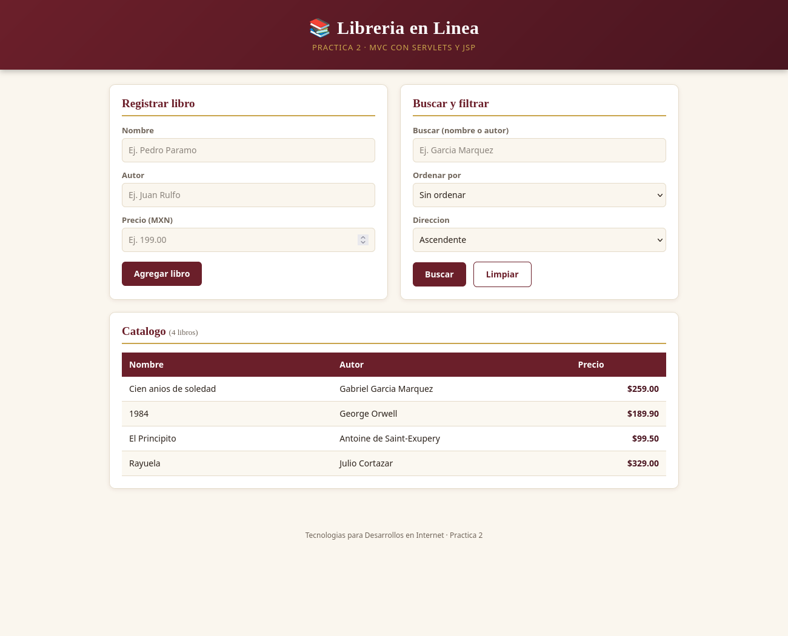
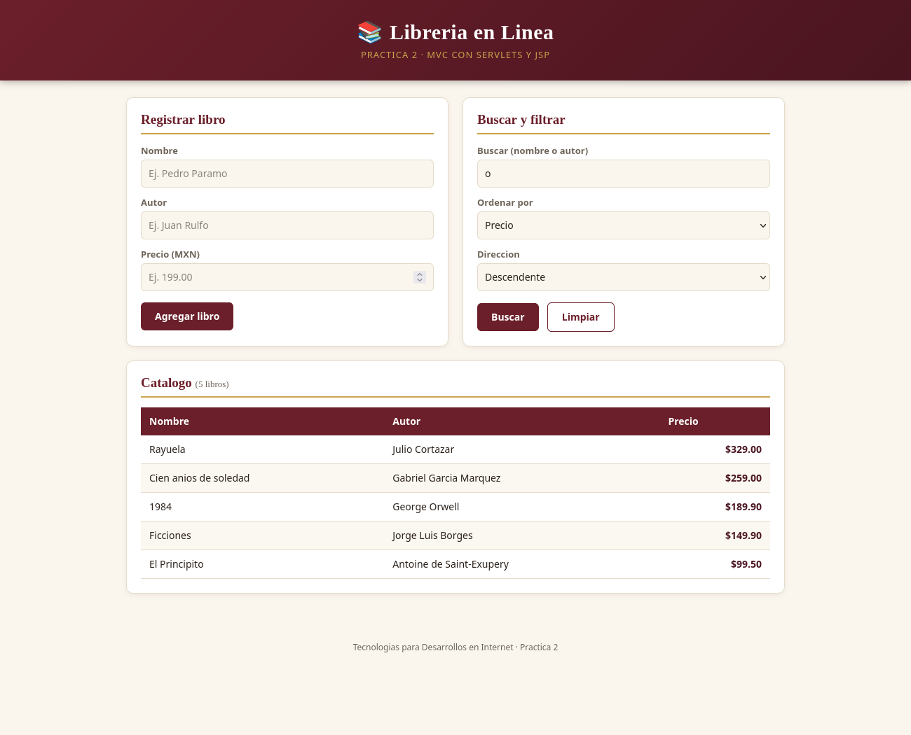
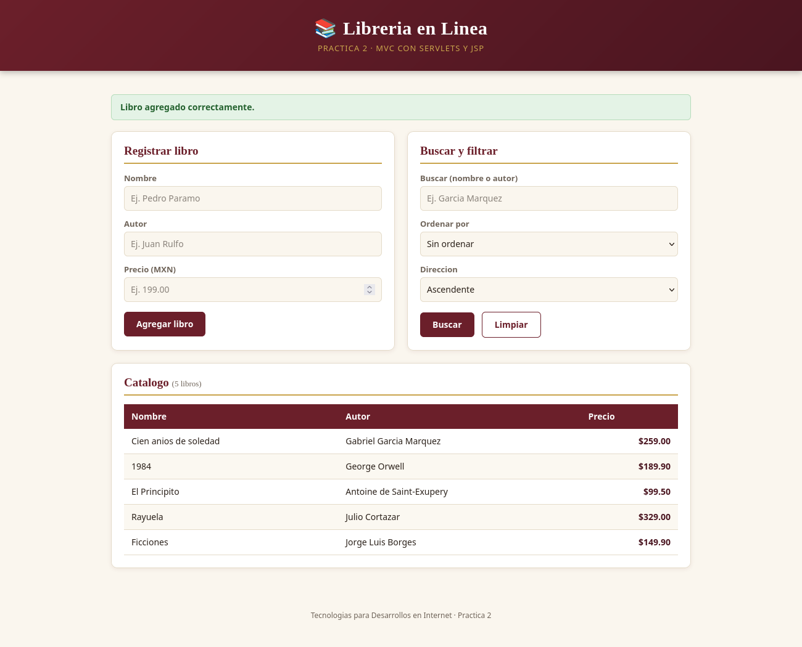

# Practica 2 - Libreria en Linea (MVC con Servlets y JSP)

**Miguel Angel Marquez Cristoval**

Aplicacion web de una libreria en linea: permite **agregar**, **listar** y
**buscar/filtrar/ordenar** libros, con arquitectura **MVC** (Model, DAO,
Controller y View) usando Servlets y JSP.

## Capturas

Catalogo con los libros guardados en MySQL:



Busqueda por texto y ordenamiento por precio (descendente):



Alta de un libro nuevo:



## Versiones

- **Java:** JDK 21
- **Servidor:** Apache Tomcat 10.1
- **Base de datos:** MySQL Server 8.0
- **Conector JDBC:** `mysql-connector-j-8.4.0.jar`
- **NetBeans** (proyecto *Web Application*, con Ant)

## Como correrlo

1. Encender MySQL:

   ```bash
   sudo systemctl start mysql
   ```

2. Abrir el proyecto en NetBeans ▸ clic derecho ▸ **Clean and Build**.
3. Clic derecho ▸ **Run**.
4. Abrir <http://localhost:8080/LibreriaOnline/>

### Solo la primera vez

Crear la base de datos (crea `libreria_online`, la tabla `libros` con
libros de ejemplo, y el usuario que usa la aplicacion):

```bash
sudo mysql -u root < esquema.sql
```

Si al dar *Run* Tomcat pide usuario y contraseña, es porque tu Tomcat no
tiene un usuario del *Manager*; se agrega en
`<carpeta-de-tomcat>/conf/tomcat-users.xml`:

```xml
<role rolename="manager-script"/>
<user username="admin" password="admin" roles="manager-script"/>
```

## Estructura (MVC)

```
src/java/mx/unam/ciencias/tdi/
├── model/Book.java              Model: entidad Libro (nombre, autor, precio)
├── dao/BookDAO.java             DAO: alta, listado y busqueda/orden en MySQL
├── controller/BookServlet.java  Controller: servlet unico (/libreria)
└── util/ConexionBD.java         conexion a MySQL (lee db.properties)

web/
├── libreria.jsp                 View: formulario, tabla y buscador
├── index.jsp                    redirige al controller
└── css/libreria.css
```

| Accion | Metodo | Que hace |
|---|---|---|
| `listar` | GET | El Controller pide los libros al DAO y los manda a la vista |
| `buscar` | GET | Filtra por texto y ordena por nombre, autor o precio |
| `agregar` | POST | Valida, guarda con el DAO y redirige a `listar` |

Los datos de conexion estan en `src/java/db.properties`.

---

*El contenido de este README se redactó con ayuda de Claude (Anthropic).*
